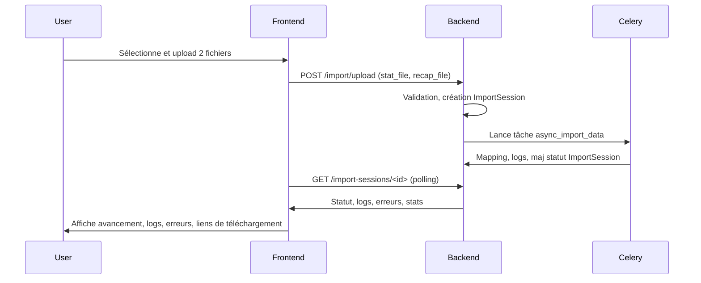

# Documentation Technique & Fonctionnelle

## Modules : `file_handling` & `importer`

---

## 1. Processus d’Upload de Fichiers

### API d’Upload
- **Endpoint** : `/api/import/upload/` (à adapter selon vos routes)
- **Vue principale** : `FileUploadAndImportView` (`importer/views.py`)
- **Méthode** : `POST`
- **Payload attendu** :
  - `stat_file` (Excel/CSV)
  - `recap_file` (Excel/CSV)
- **Permissions** : Utilisateur authentifié, rôle admin territorial ou chef technique.

### Étapes côté backend
1. **Vérification** de la présence des deux fichiers et du pays de l’utilisateur.
2. **Lecture** des fichiers via `open_excel_csv`.
3. **Validation** des entêtes attendues (headers) pour chaque fichier.
4. **Création** des objets `File` (modèle `file_handling.models.File`) pour chaque fichier uploadé.
5. **Création d’une session d’import** (`ImportSession`) qui relie les deux fichiers, l’utilisateur, le pays, et initialise le statut à `PENDING`.

---

## 2. Gestion & Suivi de la Session d’Import

### Modèle principal : `ImportSession`
- **Champs clés** :
  - `user`, `country`
  - `stat_file`, `recap_file`
  - `status` : `PENDING`, `PROCESSING`, `DONE`, `ERROR`, `DONE_WITH_ERRORS`
  - `created_at`, `started_at`, `completed_at`
  - `error_file`, `log_file_path`, `message`
  - **Statistiques** : `insured_created_count`, `claims_created_count`, `total_claimed_amount`, `total_reimbursed_amount`
- **Tracking** :
  - Chaque session d’import a un identifiant unique.
  - Les fichiers sont liés à la session.
  - Les logs et erreurs sont stockés et accessibles via des URLs générées.

### Sérialisation
- **FileSerializer** et **ImportSessionSerializer** exposent toutes les informations nécessaires pour le frontend, y compris les URLs pour télécharger les logs ou les rapports d’erreur.

---

## 3. Déroulement du Processus d’Import

### Pipeline principal (`ImporterService`)
1. **Création de la session et des fichiers**.
2. **Ouverture et nettoyage** des fichiers (suppression des lignes/colonnes vides, normalisation).
3. **Recherche de la période commune** entre les deux fichiers.
4. **Comparaison** des données (détection des non-conformités).
5. **Si données valides** : déclenchement d’une tâche asynchrone pour le mapping et l’import réel (via Celery).

---

## 4. Tâche Asynchrone & Tracking du Mapping

### Tâche Celery : `async_import_data`
- **Déclenchée** par `ImporterService.trigger_async_import()`.
- **Étapes** :
  1. Création d’un DataFrame à partir des données valides.
  2. Initialisation du `DataMapper`.
  3. **Mapping** des données ligne par ligne avec logs détaillés à chaque étape (création des objets, erreurs, etc.).
  4. Mise à jour du statut de la session (`PROCESSING` → `DONE` ou `ERROR`).
  5. **Logging** : chaque étape du mapping est loggée via `ImportLoggerService` (fichier de log lié à la session).

### Tracking en temps réel
- **Oui, c’est possible** :
  - Les logs sont écrits dans un fichier (`log_file_path` dans `ImportSession`).
  - Le frontend peut interroger périodiquement l’API pour récupérer le statut de la session (`status`) et, si besoin, afficher le contenu du log (via l’URL fournie par le serializer).
  - Les étapes du mapping sont tracées (début, fin, erreurs, nombre de lignes traitées, etc.).
  - Les erreurs et rapports sont téléchargeables.

---

## 5. Endpoints & Objets pour le Frontend

### Pour lister les fichiers
- `/api/files/` : Liste des fichiers uploadés, filtrés par pays.

### Pour suivre une session d’import
- `/api/import-sessions/<id>/` : Détail d’une session (statut, fichiers, logs, erreurs, statistiques…)
- `/api/import-sessions/<id>/download/?type=log` : Télécharger le log de la session.
- `/api/import-sessions/<id>/download/?type=error` : Télécharger le rapport d’erreur.

### Exemple de réponse ImportSession
```json
{
  "id": 12,
  "user": "john.kodjo",
  "country": "Senegal",
  "stat_file": { ... },
  "recap_file": { ... },
  "status": "PROCESSING",
  "created_at": "...",
  "started_at": "...",
  "completed_at": null,
  "error_file": null,
  "message": null,
  "error_file_url": null,
  "log_file_url": "https://.../import-sessions/12/download/?type=log"
}
```

---

## 6. Tracking du mapping et avancement pour l’UI/UX

- **Statut de la session** : à afficher en temps réel (polling ou websocket).
- **Logs détaillés** : possibilité d’afficher un “journal d’import” à l’utilisateur.
- **Statistiques d’avancement** : nombre de lignes traitées, erreurs, objets créés, etc.
- **Téléchargement des rapports** : accès direct aux fichiers d’erreur ou de log.
- **Affichage des erreurs** : messages clairs pour chaque étape échouée.

---

## 7. Recommandations UI/UX

- **Progress bar** basée sur le statut et les logs.
- **Timeline** des étapes (upload, validation, mapping, terminé/erreur).
- **Affichage dynamique** des logs (console ou panneau latéral).
- **Boutons de téléchargement** pour les rapports/logs.
- **Alertes/notifications** en cas d’erreur ou de succès.

---

## 8. Tracking du mapping dans la tâche asynchrone

**Oui, c’est faisable et déjà en partie implémenté** :
- Le mapping (`DataMapper.map_data`) logge chaque étape dans un fichier.
- Le frontend peut lire ce log pour afficher l’avancement (nombre de lignes, erreurs, étapes franchies).
- Pour un tracking encore plus “live”, il est possible d’ajouter des endpoints pour lire le log en streaming ou d’utiliser des websockets.

---

## 9. Résumé du flux global



---

## 10. Pour aller plus loin

- Ajouter un endpoint pour lire le log en temps réel (streaming).
- Utiliser des websockets pour push l’avancement.
- Ajouter des métriques plus fines (progression en %).

---

**Ce document est destiné à guider le design UI/UX et l’intégration frontend pour un suivi optimal du processus d’import.**
